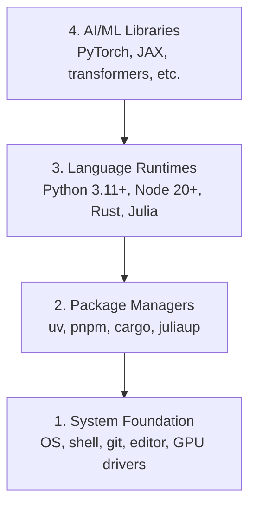

# 开发环境

> 工具会塑造你的思维方式。一次性把它们搭好，搭对。

**Type:** Build
**Languages:** Python, Node.js, Rust
**Prerequisites:** None
**Time:** ~45 minutes

## 学习目标

- 从零搭建 Python 3.11+、Node.js 20+、Rust 的工具链
- 配置虚拟环境与包管理器，实现可复现的构建
- 通过 CUDA/MPS 验证 GPU 可用性，并运行一次张量测试运算
- 理解四层栈：系统、包管理、运行时、AI 库

## 问题

你将用 Python、TypeScript、Rust、Julia 贯穿 200+ 节课来学习 AI 工程。如果环境一开始就坏了，那么每一节课都会变成跟工具打架，而不是在学习。

大多数人会跳过环境配置，然后花几个小时去排查导入错误、版本冲突、缺 CUDA 驱动。我们要一次性把这件事做对。

## 核心概念

一个 AI 工程环境有四层：



我们按自底向上的顺序安装。每一层都依赖它下面那一层。

## 动手搭建

### 第 1 步：系统基础

检查你的系统并安装基础工具。

```bash
# macOS
xcode-select --install
brew install git curl wget

# Ubuntu/Debian
sudo apt update && sudo apt install -y build-essential git curl wget

# Windows (use WSL2)
wsl --install -d Ubuntu-24.04
```

### 第 2 步：用 uv 安装 Python

我们使用 `uv`，它比 pip 快 10-100 倍，并且能自动管理虚拟环境。

```bash
curl -LsSf https://astral.sh/uv/install.sh | sh

uv python install 3.12

uv venv
source .venv/bin/activate  # or .venv\Scripts\activate on Windows

uv pip install numpy matplotlib jupyter
```

验证：

```python
import sys
print(f"Python {sys.version}")

import numpy as np
print(f"NumPy {np.__version__}")
a = np.array([1, 2, 3])
print(f"Vector: {a}, dot product with itself: {np.dot(a, a)}")
```

### 第 3 步：用 pnpm 安装 Node.js

用于 TypeScript 课程（agents、MCP servers、web apps）。

```bash
curl -fsSL https://fnm.vercel.app/install | bash
fnm install 22
fnm use 22

npm install -g pnpm

node -e "console.log('Node', process.version)"
```

### 第 4 步：Rust

用于性能敏感的课程（推理、系统实现）。

```bash
curl --proto '=https' --tlsv1.2 -sSf https://sh.rustup.rs | sh

rustc --version
cargo --version
```

### 第 5 步：Julia（可选）

适用于数学味更浓、Julia 更顺手的课程。

```bash
curl -fsSL https://install.julialang.org | sh

julia -e 'println("Julia ", VERSION)'
```

### 第 6 步：GPU 配置（如果你有）

```bash
# NVIDIA
nvidia-smi

# Install PyTorch with CUDA
uv pip install torch torchvision torchaudio --index-url https://download.pytorch.org/whl/cu124
```

```python
import torch
print(f"CUDA available: {torch.cuda.is_available()}")
if torch.cuda.is_available():
    print(f"GPU: {torch.cuda.get_device_name(0)}")
```

没有 GPU？也没问题。大多数课程都能在 CPU 上完成。对于训练量大的课程，你可以用 Google Colab 或云端 GPU。

### 第 7 步：验证全部安装

运行验证脚本：

```bash
python phases/00-setup-and-tooling/01-dev-environment/code/verify.py
```

## 用起来

你的环境现在已经能支撑本课程的每一节课。你会在不同阶段用到不同语言：

| Language | Used In | Package Manager |
|----------|---------|-----------------|
| Python | Phases 1-12 (ML, DL, NLP, Vision, Audio, LLMs) | uv |
| TypeScript | Phases 13-17 (Tools, Agents, Swarms, Infra) | pnpm |
| Rust | Phases 12, 15-17 (Performance-critical systems) | cargo |
| Julia | Phase 1 (Math foundations) | Pkg |

## 交付物

本课产出一个验证脚本，任何人都可以用它检查自己的环境是否准备就绪。

你也可以查看 `outputs/prompt-env-check.md`，里面有一个 prompt，能让 AI 助手更高效地帮你诊断环境问题。

## 练习

1. 运行验证脚本并修复所有失败项
2. 为本课程创建一个 Python 虚拟环境，并安装 PyTorch
3. 用四种语言分别写一个 “hello world”，并各自运行一遍

