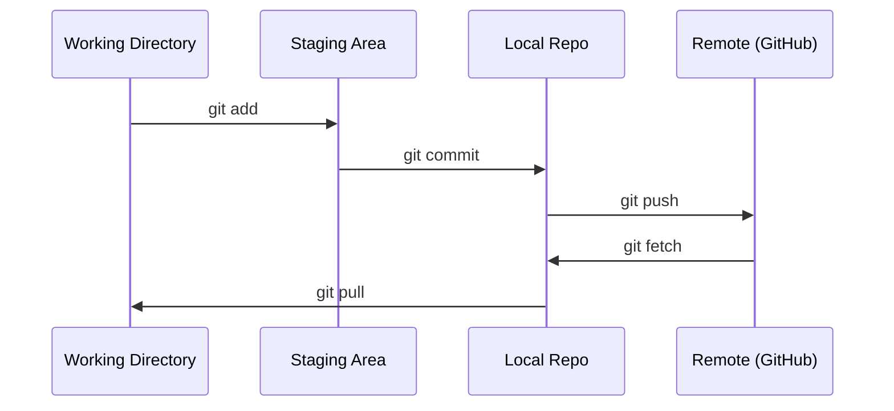

# Git 与协作

> 版本控制不是可选项。你做的每一次实验、每一个模型、每一节课的产物，都应该被追踪。

**Type:** Learn
**Languages:** --
**Prerequisites:** Phase 0, Lesson 01
**Time:** ~30 minutes

## 学习目标

- 配置 git 身份信息，并掌握 add、commit、push 的日常工作流
- 通过分支隔离实验，不把 main 搞坏
- 写一个能排除模型权重与大文件的 `.gitignore`
- 用 `git log` 阅读提交历史，理解项目如何演进

## 问题

你将跨 20 个阶段写下数百个代码文件。没有版本控制，你会丢失工作成果、把东西改坏却无法回退，也没有可靠的协作方式。

Git 是工具。GitHub 是代码存放的位置。本课只讲你在这门课里真正会用到的部分，多的不会讲。

## 核心概念



记住三件事：
1. 经常保存（`git commit`）
2. 推送到远端备份（`git push`）
3. 实验用分支隔离（`git checkout -b experiment`）

## 动手搭建

### 第 1 步：配置 git

```bash
git config --global user.name "Your Name"
git config --global user.email "you@example.com"
```

### 第 2 步：日常工作流

```bash
git status
git add file.py
git commit -m "Add perceptron implementation"
git push origin main
```

### 第 3 步：用分支做实验

```bash
git checkout -b experiment/new-optimizer

# ... make changes, commit ...

git checkout main
git merge experiment/new-optimizer
```

### 第 4 步：在本课程仓库里如何用

```bash
git clone https://github.com/rohitg00/ai-engineering-from-scratch.git
cd ai-engineering-from-scratch

git checkout -b my-progress
# work through lessons, commit your code
git push origin my-progress
```

## 用起来

对这门课来说，你只需要这些命令：

| Command | When |
|---------|------|
| `git clone` | 获取课程仓库 |
| `git add` + `git commit` | 保存你的工作 |
| `git push` | 备份到 GitHub |
| `git checkout -b` | 做实验但不影响 main |
| `git log --oneline` | 回顾你做过的事 |

就这些。你不需要为了这门课去学 rebase、cherry-pick 或 submodules。

## 练习

1. 克隆本仓库，新建一个叫 `my-progress` 的分支，创建一个文件，commit，然后 push
2. 创建一个 `.gitignore`，排除模型权重文件（`.pt`、`.pth`、`.safetensors`）
3. 用 `git log --oneline` 看看本仓库的提交历史，读一读这些课是怎么被加进来的

## 关键术语

| Term | What people say | What it actually means |
|------|----------------|----------------------|
| Commit | "Saving" | 在某个时间点对整个项目做一次快照 |
| Branch | "A copy" | 指向某个提交的指针；你工作时它会不断向前移动 |
| Merge | "Combining code" | 把一个分支上的变更应用到另一个分支 |
| Remote | "The cloud" | 托管在某个地方的仓库副本（GitHub、GitLab 等） |

