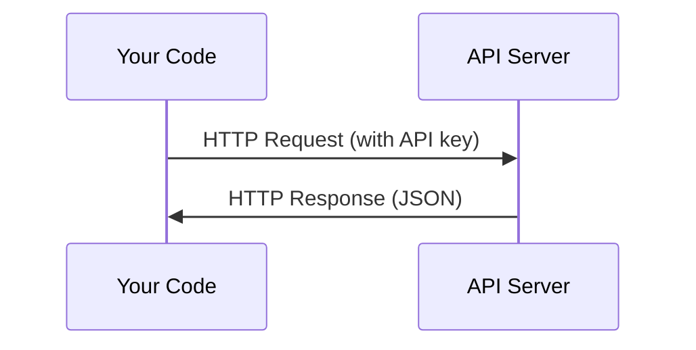

# API 与密钥

> 每个 AI API 的工作方式都一样：发请求，收响应。细节会变，但模式不变。

**Type:** Build
**Languages:** Python, TypeScript
**Prerequisites:** Phase 0, Lesson 01
**Time:** ~30 minutes

## 学习目标

- 使用环境变量与 `.env` 文件安全地保存 API key
- 分别用 Anthropic Python SDK 与原生 HTTP 完成一次 LLM API 调用
- 对比 SDK 与原生 HTTP 的请求/响应格式，便于调试
- 识别并处理常见 API 错误，包括鉴权失败与限流

## 问题

从 Phase 11 开始，你会调用 LLM API（Anthropic、OpenAI、Google）。在 Phase 13-16，你会构建在循环里反复调用这些 API 的 agent。你需要理解 API key 怎么工作、如何安全保存，以及如何完成第一次 API 调用。

## 核心概念



每一次 API 调用都包含：
1. Endpoint（URL）
2. API key（鉴权）
3. Request body（你想要什么）
4. Response body（返回了什么）

## 动手搭建

### 第 1 步：安全保存 API key

永远不要把 API key 写进代码里。用环境变量。

```bash
export ANTHROPIC_API_KEY="sk-ant-..."
export OPENAI_API_KEY="sk-..."
```

或者用 `.env` 文件（并把它加入 `.gitignore`）：

```text
ANTHROPIC_API_KEY=sk-ant-...
OPENAI_API_KEY=sk-...
```

### 第 2 步：第一次 API 调用（Python）

```python
import anthropic

client = anthropic.Anthropic()

response = client.messages.create(
    model="claude-sonnet-4-20250514",
    max_tokens=256,
    messages=[{"role": "user", "content": "What is a neural network in one sentence?"}]
)

print(response.content[0].text)
```

### 第 3 步：第一次 API 调用（TypeScript）

```typescript
import Anthropic from "@anthropic-ai/sdk";

const client = new Anthropic();

const response = await client.messages.create({
  model: "claude-sonnet-4-20250514",
  max_tokens: 256,
  messages: [{ role: "user", content: "What is a neural network in one sentence?" }],
});

console.log(response.content[0].text);
```

### 第 4 步：原生 HTTP（不使用 SDK）

```python
import os
import urllib.request
import json

url = "https://api.anthropic.com/v1/messages"
headers = {
    "Content-Type": "application/json",
    "x-api-key": os.environ["ANTHROPIC_API_KEY"],
    "anthropic-version": "2023-06-01",
}
body = json.dumps({
    "model": "claude-sonnet-4-20250514",
    "max_tokens": 256,
    "messages": [{"role": "user", "content": "What is a neural network in one sentence?"}],
}).encode()

req = urllib.request.Request(url, data=body, headers=headers, method="POST")
with urllib.request.urlopen(req) as resp:
    result = json.loads(resp.read())
    print(result["content"][0]["text"])
```

这就是 SDK 在底层做的事。理解原生 HTTP 调用在调试时非常有用。

## 用起来

对这门课来说：

| API | When you need it | Free tier |
|-----|-----------------|-----------|
| Anthropic (Claude) | Phases 11-16 (agents, tools) | $5 credit on signup |
| OpenAI | Phase 11 (comparison) | $5 credit on signup |
| Hugging Face | Phases 4-10 (models, datasets) | Free |

你现在不需要一次性把所有平台都配置好。课程需要哪个，你再配哪个就行。

## 交付物

本课产出：
- `outputs/prompt-api-troubleshooter.md`：用于诊断常见 API 错误

## 练习

1. 申请一个 Anthropic API key 并完成第一次 API 调用
2. 试试原生 HTTP 版本，对比它与 SDK 版本的响应格式
3. 故意使用一个错误的 API key，阅读并理解报错信息

## 关键术语

| Term | What people say | What it actually means |
|------|----------------|----------------------|
| API key | "Password for the API" | 唯一字符串，用于标识账号并授权请求 |
| Rate limit | "They're throttling me" | 每分钟/每小时的最大请求数，用于防滥用与公平使用 |
| Token | "A word" (in API context) | 计费单位：输入与输出 token 分开计数与计费 |
| Streaming | "Real-time responses" | 不等完整结果，而是边生成边返回（逐词/逐块） |

