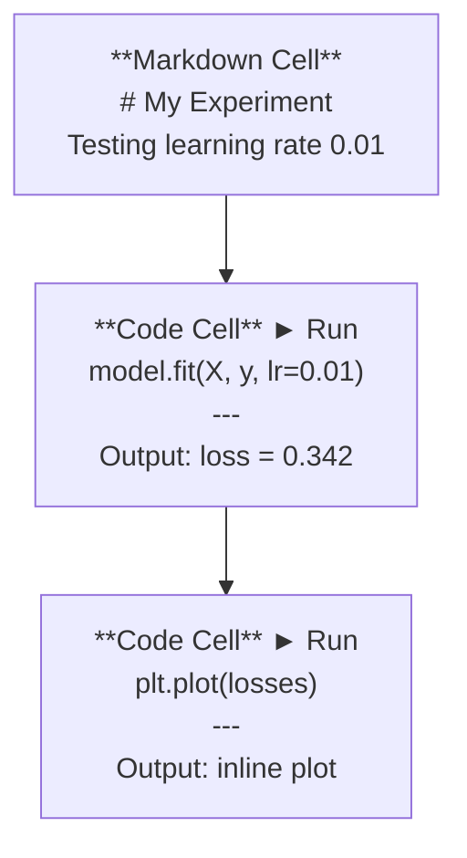
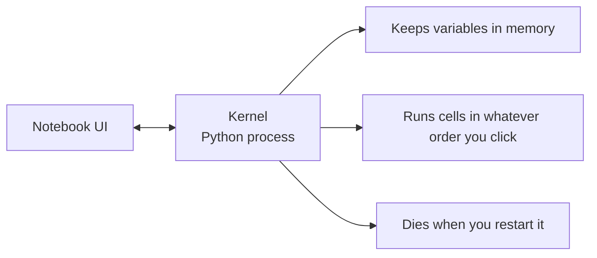

# Jupyter Notebooks

> Notebook 是 AI 工程的实验台。你在这里快速原型，然后把有效的部分搬进“生产代码”。

**Type:** Build
**Languages:** Python
**Prerequisites:** Phase 0, Lesson 01
**Time:** ~30 minutes

## 学习目标

- 安装并启动 JupyterLab、Jupyter Notebook，或在 VS Code 中使用 Jupyter 扩展
- 使用魔法命令（`%timeit`、`%%time`、`%matplotlib inline`）做基准测试与内联可视化
- 区分何时使用 notebook、何时使用脚本，并实践“在 notebook 探索，在脚本交付”的工作流
- 识别并避免常见 notebook 陷阱：乱序执行、隐藏状态、内存泄漏

## 问题

几乎每篇 AI 论文、教程、Kaggle 比赛都会用 Jupyter notebook。它让你可以分块运行代码、在同一页面看到输出、把代码和解释写在一起、快速迭代。如果你试图不借助 notebook 学 AI，就像做数学作业却不用草稿纸。

但 notebook 也有真实的“坑”。很多人把它用在它不擅长的事情上。知道什么时候用 notebook，什么时候改用脚本，会让你以后少踩无数调试噩梦。

## 核心概念

Notebook 是一组 cell。每个 cell 要么是代码，要么是文本。



Kernel 是后台运行的 Python 进程。当你运行某个 cell 时，Notebook 会把代码发送给 kernel 执行，再把结果返回展示。所有 cell 共享同一个 kernel，所以变量会在 cell 之间持续存在。



“按你点击的顺序运行”既是超能力，也是踩坑点。

## 动手搭建

### 第 1 步：选择界面

三种界面，一种文件格式：

| Interface | Install | Best for |
|-----------|---------|----------|
| JupyterLab | `pip install jupyterlab` then `jupyter lab` | 更完整的 IDE 体验，多标签、文件浏览、终端 |
| Jupyter Notebook | `pip install notebook` then `jupyter notebook` | 简单轻量，一次专注一个 notebook |
| VS Code | Install "Jupyter" extension | 直接在编辑器里，用 git 集成与调试能力 |

三者读写同一种 `.ipynb` 文件。你喜欢哪个就用哪个。JupyterLab 在 AI 工作里最常见。

```bash
pip install jupyterlab
jupyter lab
```

### 第 2 步：你真正会用到的快捷键

你会在两种模式之间切换：按 `Escape` 进入命令模式（左侧蓝条），按 `Enter` 进入编辑模式（左侧绿条）。

**命令模式（最常用）：**

| Key | Action |
|-----|--------|
| `Shift+Enter` | 运行 cell，并移动到下一个 |
| `A` | 在上方插入 cell |
| `B` | 在下方插入 cell |
| `DD` | 删除 cell |
| `M` | 转为 markdown |
| `Y` | 转为代码 |
| `Z` | 撤销 cell 操作 |
| `Ctrl+Shift+H` | 显示所有快捷键 |

**编辑模式：**

| Key | Action |
|-----|--------|
| `Tab` | 自动补全 |
| `Shift+Tab` | 显示函数签名 |
| `Ctrl+/` | 注释/取消注释 |

`Shift+Enter` 是你每天会按上千次的快捷键，先把它记住。

### 第 3 步：Cell 类型

**代码 cell** 运行 Python 并显示输出：

```python
import numpy as np
data = np.random.randn(1000)
data.mean(), data.std()
```

Output: `(0.0032, 0.9987)`

**Markdown cell** 渲染格式化文本。用它记录你在做什么、为什么这么做。支持标题、粗体、斜体、LaTeX 数学公式（`$E = mc^2$`）、表格和图片。

### 第 4 步：魔法命令

这些不是 Python，而是 Jupyter 专用命令。以 `%` 开头的是“行魔法”，以 `%%` 开头的是“cell 魔法”。

**计时：**

```python
%timeit np.random.randn(10000)
```

Output: `45.2 us +/- 1.3 us per loop`

```python
%%time
model.fit(X_train, y_train, epochs=10)
```

Output: `Wall time: 2.34 s`

`%timeit` 会多次运行并求平均，`%%time` 只运行一次。微基准用 `%timeit`，训练跑一遍用 `%%time`。

**开启内联绘图：**

```python
%matplotlib inline
```

之后所有 `plt.plot()` / `plt.show()` 都会直接渲染在 notebook 里。

**不离开 notebook 就安装包：**

```python
!pip install scikit-learn
```

`!` 前缀表示运行任意 shell 命令。

**查看环境变量：**

```python
%env CUDA_VISIBLE_DEVICES
```

### 第 5 步：在 notebook 里显示富输出

Notebook 会自动展示某个 cell 的最后一个表达式。但你也可以更明确地控制输出：

```python
import pandas as pd

df = pd.DataFrame({
    "model": ["Linear", "Random Forest", "Neural Net"],
    "accuracy": [0.72, 0.89, 0.94],
    "training_time": [0.1, 2.3, 45.6]
})
df
```

这会渲染成 HTML 表格，而不是纯文本打印。绘图也是一样：

```python
import matplotlib.pyplot as plt

plt.figure(figsize=(8, 4))
plt.plot([1, 2, 3, 4], [1, 4, 2, 3])
plt.title("Inline Plot")
plt.show()
```

图会直接出现在 cell 下方。这就是 notebook 在 AI 里统治级的原因：数据、图和代码在同一处。

显示图片：

```python
from IPython.display import Image, display
display(Image(filename="architecture.png"))
```

### 第 6 步：Google Colab

Colab 是云端的免费 Jupyter notebook。它提供 GPU、预装常用库，并且能和 Google Drive 集成。基本不需要任何本地配置。

1. 打开 [colab.research.google.com](https://colab.research.google.com)
2. 上传本课程任意 `.ipynb` 文件
3. Runtime > Change runtime type > T4 GPU（免费）

Colab 与本地 Jupyter 的差异：
- 文件不会跨 session 自动保留（保存到 Drive 或下载）
- 预装：numpy、pandas、matplotlib、torch、tensorflow、sklearn
- `from google.colab import files` 用于上传/下载文件
- `from google.colab import drive; drive.mount('/content/drive')` 用于持久化存储
- 空闲 90 分钟会断开（免费版）

## 用起来

### Notebook vs 脚本：什么时候用哪个

| Use notebooks for | Use scripts for |
|-------------------|-----------------|
| 探索数据集 | 训练流水线 |
| 原型模型 | 可复用工具 |
| 可视化结果 | 任何带 `if __name__` 的程序入口 |
| 解释你的工作 | 需要按计划运行的代码 |
| 快速实验 | 生产代码 |
| 课程练习 | 包与库 |

规则：**在 notebook 探索，在脚本交付**。

AI 里一种常见工作流：
1. 在 notebook 里探索数据
2. 在 notebook 里快速搭原型
3. 跑通后，把代码移到 `.py` 文件
4. 再把这些 `.py` 作为模块导回 notebook，继续实验

### 常见陷阱

**乱序执行。** 你先跑 cell 5，再跑 cell 2，再跑 cell 7。在你机器上能工作，但别人从上到下运行就崩。修复：分享前先 Kernel > Restart & Run All。

**隐藏状态。** 你删了某个 cell，但它创建的变量还留在内存里。Notebook 看起来很“干净”，却依赖一个幽灵 cell。修复：定期重启 kernel。

**内存泄漏。** 先加载 4GB 数据集、训练模型，再加载另一个数据集。内存一直不释放。修复：`del variable_name` + `gc.collect()`，或者重启 kernel。

## 交付物

本课产出：
- `outputs/prompt-notebook-helper.md`：用于排查 notebook 常见问题

## 练习

1. 打开 JupyterLab，新建 notebook，用 `%timeit` 对比“列表推导 vs numpy”在生成 100,000 个随机数数组时的速度
2. 新建一个同时包含 markdown 与代码 cell 的 notebook：加载 CSV、展示 dataframe、画一张图；然后用 Kernel > Restart & Run All 验证从上到下可复现
3. 把 `code/notebook_tips.py` 的代码粘贴到 Colab notebook 中，用免费 GPU 跑一遍

## 关键术语

| Term | What people say | What it actually means |
|------|----------------|----------------------|
| Kernel | "The thing running my code" | 一个独立的 Python 进程：执行 cell，并把变量保存在内存里 |
| Cell | "A code block" | Notebook 的可独立运行单元：代码或 markdown |
| Magic command | "Jupyter tricks" | 以 `%`/`%%` 开头的特殊命令，用于控制 notebook 环境 |
| `.ipynb` | "Notebook file" | 记录 cell、输出与元数据的 JSON 文件（IPython Notebook） |

## 延伸阅读

- [JupyterLab Docs](https://jupyterlab.readthedocs.io/)：完整功能文档
- [Google Colab FAQ](https://research.google.com/colaboratory/faq.html)：Colab 的限制与特性
- [28 Jupyter Notebook Tips](https://www.dataquest.io/blog/jupyter-notebook-tips-tricks-shortcuts/)：进阶快捷技巧

