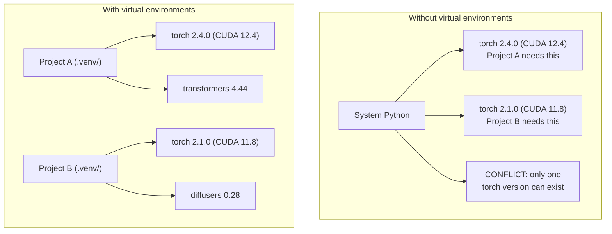

# Python 环境管理

> 依赖地狱是真实存在的。虚拟环境是解药。

**Type:** Build
**Languages:** Shell
**Prerequisites:** Phase 0, Lesson 01
**Time:** ~30 minutes

## 学习目标

- 使用 `uv`、`venv` 或 `conda` 创建隔离的虚拟环境
- 编写包含可选依赖组的 `pyproject.toml`，并生成锁文件以保证可复现
- 诊断并修复常见坑：全局安装、pip/conda 混用、CUDA 版本不匹配
- 为依赖可能冲突的多阶段项目设计“按阶段分环境”的策略

## 问题

你为一个微调项目安装了 PyTorch 2.4。下周另一个项目需要 PyTorch 2.1（因为它锁死了特定 CUDA 构建）。你全局升级一次，第一个项目就坏；全局降级一次，第二个项目又坏。

这就是依赖地狱。在 AI/ML 工作里它特别常见，因为：

- PyTorch、JAX、TensorFlow 都会自带各自的 CUDA 绑定
- 模型相关库通常会钉死特定框架版本
- 全局 `pip install` 会直接覆盖系统里已有的版本
- CUDA 11.8 的构建不一定能和 CUDA 12.x 的驱动组合工作（反之亦然）

解决方式：每个项目都有自己独立的环境与依赖集合。

## 核心概念



## 动手搭建

### 选项 1：uv venv（推荐）

`uv` 是最快的 Python 包管理工具之一（比 pip 快 10-100 倍）。它把虚拟环境、Python 版本、依赖解析都放在同一个工具里。

```bash
curl -LsSf https://astral.sh/uv/install.sh | sh

uv python install 3.12

cd your-project
uv venv
source .venv/bin/activate
```

安装包：

```bash
uv pip install torch numpy
```

一步创建带 `pyproject.toml` 的项目：

```bash
uv init my-ai-project
cd my-ai-project
uv add torch numpy matplotlib
```

### 选项 2：venv（内置）

如果你无法安装 `uv`，Python 自带 `venv`：

```bash
python3 -m venv .venv
source .venv/bin/activate  # Linux/macOS
.venv\Scripts\activate     # Windows

pip install torch numpy
```

它比 `uv` 慢一些，但只要有 Python 就能用。

### 选项 3：conda（确实需要时再用）

Conda 能管理非 Python 依赖，比如 CUDA toolkit、cuDNN 和一些 C 库。适用场景：

- 你需要某个特定版本的 CUDA toolkit，但不想系统级安装
- 你在共享集群上，没有权限安装系统包
- 某个库的官方安装指南明确建议 “use conda”

```bash
# Install miniconda (not the full Anaconda)
curl -LsSf https://repo.anaconda.com/miniconda/Miniconda3-latest-Linux-x86_64.sh -o miniconda.sh
bash miniconda.sh -b

conda create -n myproject python=3.12
conda activate myproject

conda install pytorch torchvision torchaudio pytorch-cuda=12.4 -c pytorch -c nvidia
```

一条规则：如果你在一个环境里用 conda，那这个环境里的包也尽量都用 conda 装。往 conda 环境里混 `pip install` 很容易把依赖解析搞崩，排查起来很痛苦。

### 本课程建议：按阶段分环境

你当然可以给整门课只建一个环境。但不建议。不同阶段需要的依赖可能不同（甚至冲突）。

策略示例：

```text
ai-engineering-from-scratch/
├── .venv/                    <-- shared lightweight env for phases 0-3
├── phases/
│   ├── 04-neural-networks/
│   │   └── .venv/            <-- PyTorch env
│   ├── 05-cnns/
│   │   └── .venv/            <-- same PyTorch env (symlink or shared)
│   ├── 08-transformers/
│   │   └── .venv/            <-- might need different transformer versions
│   └── 11-llm-apis/
│       └── .venv/            <-- API SDKs, no torch needed
```

本课的 `code/env_setup.sh` 脚本会为课程创建基础环境。

## pyproject.toml 基础

每个 Python 项目都应该有 `pyproject.toml`。它把 `setup.py`、`setup.cfg`、`requirements.txt` 的角色合到一个文件里。

```toml
[project]
name = "ai-engineering-from-scratch"
version = "0.1.0"
requires-python = ">=3.11"
dependencies = [
    "numpy>=1.26",
    "matplotlib>=3.8",
    "jupyter>=1.0",
    "scikit-learn>=1.4",
]

[project.optional-dependencies]
torch = ["torch>=2.3", "torchvision>=0.18"]
llm = ["anthropic>=0.39", "openai>=1.50"]
```

然后安装：

```bash
uv pip install -e ".[torch]"    # base + PyTorch
uv pip install -e ".[llm]"     # base + LLM SDKs
uv pip install -e ".[torch,llm]" # everything
```

## 锁文件（Lockfiles）

锁文件会把所有依赖（包含间接依赖）钉死到精确版本。这样才能保证可复现：任何人从锁文件安装，都会得到一模一样的包版本集合。

```bash
# uv generates uv.lock automatically when using uv add
uv add numpy

# pip-tools approach
uv pip compile pyproject.toml -o requirements.lock
uv pip install -r requirements.lock
```

把锁文件提交到 git。当别人克隆仓库时，从锁文件安装即可获得一致环境。

## 常见错误

### 1. 全局安装

```bash
pip install torch  # BAD: installs to system Python

source .venv/bin/activate
pip install torch  # GOOD: installs to virtual environment
```

检查包到底装到哪里：

```bash
which python       # should show .venv/bin/python, not /usr/bin/python
which pip           # should show .venv/bin/pip
```

### 2. pip 与 conda 混用

```bash
conda create -n myenv python=3.12
conda activate myenv
conda install pytorch -c pytorch
pip install some-other-package   # BAD: can break conda's dependency tracking
conda install some-other-package # GOOD: let conda manage everything
```

如果你必须在 conda 环境里用 pip（有些包只有 pip 才有），先把 conda 包全部装完，再把 pip 包最后装。

### 3. 忘记激活环境

```bash
python train.py           # uses system Python, missing packages
source .venv/bin/activate
python train.py           # uses project Python, packages found
```

你的 shell 提示符应该显示环境名：

```text
(.venv) $ python train.py
```

### 4. 把 .venv 提交进 git

```bash
echo ".venv/" >> .gitignore
```

虚拟环境动辄 200MB-2GB，而且本地不可移植。应该提交的是 `pyproject.toml` 和锁文件。

### 5. CUDA 版本不匹配

```bash
nvidia-smi                # shows driver CUDA version (e.g., 12.4)
python -c "import torch; print(torch.version.cuda)"  # shows PyTorch CUDA version

# These must be compatible.
# PyTorch CUDA version must be <= driver CUDA version.
```

## 用起来

运行本课脚本创建课程环境：

```bash
bash phases/00-setup-and-tooling/06-python-environments/code/env_setup.sh
```

它会在仓库根目录创建 `.venv`，并安装与验证核心依赖。

## 练习

1. 运行 `env_setup.sh` 并确认所有检查通过
2. 再建一个虚拟环境，在其中安装一个不同版本的 numpy，并验证两个环境互不影响
3. 为一个同时需要 PyTorch 和 Anthropic SDK 的项目写一个 `pyproject.toml`
4. 故意不激活 venv 直接全局安装一个包，观察它装到哪里，然后卸载

## 关键术语

| Term | What people say | What it actually means |
|------|----------------|----------------------|
| Virtual environment | "A venv" | 一个隔离目录：包含 Python 解释器与依赖包，独立于系统 Python |
| Lockfile | "Pinned dependencies" | 列出每个包及精确版本的文件，保证跨机器安装一致 |
| pyproject.toml | "The new setup.py" | Python 项目标准配置文件，替代 setup.py/setup.cfg/requirements.txt |
| Transitive dependency | "A dependency of a dependency" | 包 B 依赖 C；若 A 依赖 B，则 C 是 A 的间接依赖 |
| CUDA mismatch | "My GPU isn't working" | PyTorch 编译所用 CUDA 版本与显卡驱动支持版本不兼容 |

