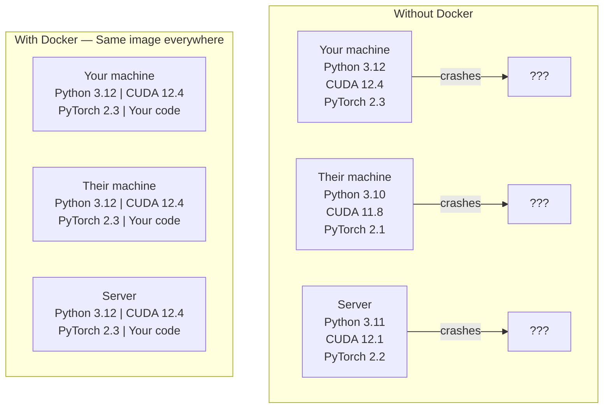

# 面向 AI 的 Docker

> 容器让“在我机器上能跑”成为历史。

**Type:** Build
**Languages:** Docker
**Prerequisites:** Phase 0, Lessons 01 and 03
**Time:** ~60 minutes

## 学习目标

- 从 Dockerfile 构建支持 GPU 的镜像，包含 CUDA、PyTorch 与常用 AI 库
- 将宿主机目录挂载为 volume，在容器重建后仍能保留模型、数据集与代码
- 配置 NVIDIA Container Toolkit，让容器内部可以访问 GPU
- 使用 Docker Compose 编排多服务 AI 应用（推理服务 + 向量数据库）

## 问题

你在笔记本上用 PyTorch 2.3、CUDA 12.4、Python 3.12 训练了一个模型。你的同事机器上是 PyTorch 2.1、CUDA 11.8、Python 3.10，于是你的模型在他们那里崩了。但你的 Dockerfile 在两台机器上都能跑。

AI 项目是依赖噩梦。典型栈包含 Python、PyTorch、CUDA 驱动、cuDNN、系统级 C 库，以及像 flash-attn 这种对编译器版本极其挑剔的包。Docker 把这些打包成一个镜像，让它在任何地方都以相同方式运行。

## 核心概念

Docker 把你的代码、运行时、库与系统工具封装进一个隔离单元，叫 container。你可以把它理解成轻量级虚拟机，但它共享宿主机的 OS kernel（不自带 kernel），因此启动只要几秒而不是几分钟。



### 为什么 AI 项目比多数项目更需要 Docker

1. **GPU 驱动很脆弱。** CUDA 12.4 的代码无法在 CUDA 11.8 上运行。Docker 把 CUDA toolkit 隔离在容器里，同时通过 NVIDIA Container Toolkit 共享宿主机的 GPU driver。
2. **模型权重很大。** 7B 参数模型在 fp16 下约 14GB。你不希望每次重建镜像都重新下载。Docker volume 可以把宿主机上的 models 目录挂进容器。
3. **多服务架构很常见。** 真正的 AI 应用通常不只是一个 Python 脚本，而是推理服务、RAG 的向量数据库、也许还有 Web 前端。Docker Compose 用一条命令就能编排它们。

### 关键术语

| Term | What it means |
|------|---------------|
| Image | 只读模板，相当于“配方”，由 Dockerfile 构建 |
| Container | 镜像的运行实例，相当于“厨房” |
| Dockerfile | 构建镜像的指令，分层执行 |
| Volume | 持久化存储，容器重启或删除后仍能保留 |
| docker-compose | 用 YAML 定义多容器应用的工具 |

### AI 中常见的容器模式

```text
Dev Container
  Full toolkit. Editor support. Jupyter. Debugging tools.
  Used during development and experimentation.

Training Container
  Minimal. Just the training script and dependencies.
  Runs on GPU clusters. No editor, no Jupyter.

Inference Container
  Optimized for serving. Small image. Fast cold start.
  Runs behind a load balancer in production.
```

## 动手搭建

### 第 1 步：安装 Docker

```bash
# macOS
brew install --cask docker
open /Applications/Docker.app

# Ubuntu
curl -fsSL https://get.docker.com | sh
sudo usermod -aG docker $USER
# Log out and back in for group change to take effect
```

验证：

```bash
docker --version
docker run hello-world
```

### 第 2 步：安装 NVIDIA Container Toolkit（仅 Linux + NVIDIA GPU）

它让 Docker 容器可以访问 GPU。macOS 与 Windows（WSL2）用户可以跳过这一步；Docker Desktop 在这些平台的 GPU 直通方式不同。

```bash
distribution=$(. /etc/os-release;echo $ID$VERSION_ID)
curl -fsSL https://nvidia.github.io/libnvidia-container/gpgkey | sudo gpg --dearmor -o /usr/share/keyrings/nvidia-container-toolkit-keyring.gpg
curl -s -L https://nvidia.github.io/libnvidia-container/$distribution/libnvidia-container.list | \
    sed 's#deb https://#deb [signed-by=/usr/share/keyrings/nvidia-container-toolkit-keyring.gpg] https://#g' | \
    sudo tee /etc/apt/sources.list.d/nvidia-container-toolkit.list

sudo apt-get update
sudo apt-get install -y nvidia-container-toolkit
sudo nvidia-ctk runtime configure --runtime=docker
sudo systemctl restart docker
```

测试容器内 GPU 访问：

```bash
docker run --rm --gpus all nvidia/cuda:12.4.1-base-ubuntu22.04 nvidia-smi
```

如果能看到 GPU 信息，说明 toolkit 正常工作。

### 第 3 步：理解基础镜像（base images）

选对 base image 可以省掉大量排查时间。

```text
nvidia/cuda:12.4.1-devel-ubuntu22.04
  Full CUDA toolkit. Compilers included.
  Use for: building packages that need nvcc (flash-attn, bitsandbytes)
  Size: ~4 GB

nvidia/cuda:12.4.1-runtime-ubuntu22.04
  CUDA runtime only. No compilers.
  Use for: running pre-built code
  Size: ~1.5 GB

pytorch/pytorch:2.3.1-cuda12.4-cudnn9-runtime
  PyTorch pre-installed on top of CUDA.
  Use for: skipping the PyTorch install step
  Size: ~6 GB

python:3.12-slim
  No CUDA. CPU only.
  Use for: inference on CPU, lightweight tools
  Size: ~150 MB
```

### 第 4 步：写一个用于 AI 开发的 Dockerfile

本课的 Dockerfile 在 `code/Dockerfile`。先通读一遍：

```dockerfile
FROM nvidia/cuda:12.4.1-devel-ubuntu22.04

ENV DEBIAN_FRONTEND=noninteractive
ENV PYTHONUNBUFFERED=1

RUN apt-get update && apt-get install -y --no-install-recommends \
    python3.12 \
    python3.12-venv \
    python3.12-dev \
    python3-pip \
    git \
    curl \
    build-essential \
    && rm -rf /var/lib/apt/lists/*

RUN update-alternatives --install /usr/bin/python python /usr/bin/python3.12 1

RUN python -m pip install --no-cache-dir --upgrade pip setuptools wheel

RUN python -m pip install --no-cache-dir \
    torch==2.3.1 \
    torchvision==0.18.1 \
    torchaudio==2.3.1 \
    --index-url https://download.pytorch.org/whl/cu124

RUN python -m pip install --no-cache-dir \
    numpy \
    pandas \
    scikit-learn \
    matplotlib \
    jupyter \
    transformers \
    datasets \
    accelerate \
    safetensors

WORKDIR /workspace

VOLUME ["/workspace", "/models"]

EXPOSE 8888

CMD ["python"]
```

构建：

```bash
docker build -t ai-dev -f phases/00-setup-and-tooling/07-docker-for-ai/code/Dockerfile .
```

第一次会比较久（下载 CUDA base image + PyTorch）。之后会复用缓存层，速度会快很多。

运行：

```bash
docker run --rm -it --gpus all \
    -v $(pwd):/workspace \
    -v ~/models:/models \
    ai-dev python -c "import torch; print(f'PyTorch {torch.__version__}, CUDA: {torch.cuda.is_available()}')"
```

在容器里启动 Jupyter：

```bash
docker run --rm -it --gpus all \
    -v $(pwd):/workspace \
    -v ~/models:/models \
    -p 8888:8888 \
    ai-dev jupyter notebook --ip=0.0.0.0 --port=8888 --no-browser --allow-root
```

### 第 5 步：为数据与模型挂载 volume

对 AI 来说，volume mount 非常关键。否则你下载的 14GB 模型在容器停止后就消失了。

```bash
# Mount your code
-v $(pwd):/workspace

# Mount a shared models directory
-v ~/models:/models

# Mount datasets
-v ~/datasets:/data
```

在训练脚本中，从挂载路径读取：

```python
from transformers import AutoModel

model = AutoModel.from_pretrained("/models/llama-7b")
```

模型实际存放在宿主机文件系统。你可以随意重建容器而不需要重复下载。

### 第 6 步：用 Docker Compose 运行多服务 AI 应用

一个真实的 RAG 应用通常需要推理服务和向量数据库。Docker Compose 一条命令就能同时跑起来。

查看 `code/docker-compose.yml`：

```yaml
services:
  ai-dev:
    build:
      context: .
      dockerfile: Dockerfile
    deploy:
      resources:
        reservations:
          devices:
            - driver: nvidia
              count: all
              capabilities: [gpu]
    volumes:
      - ../../../:/workspace
      - ~/models:/models
      - ~/datasets:/data
    ports:
      - "8888:8888"
    stdin_open: true
    tty: true
    command: jupyter notebook --ip=0.0.0.0 --port=8888 --no-browser --allow-root

  qdrant:
    image: qdrant/qdrant:v1.12.5
    ports:
      - "6333:6333"
      - "6334:6334"
    volumes:
      - qdrant_data:/qdrant/storage

volumes:
  qdrant_data:
```

启动：

```bash
cd phases/00-setup-and-tooling/07-docker-for-ai/code
docker compose up -d
```

现在你的 AI dev 容器可以用服务名访问向量数据库：`http://qdrant:6333`。Docker Compose 会自动创建共享网络。

在 AI 容器内测试连接：

```python
from qdrant_client import QdrantClient

client = QdrantClient(host="qdrant", port=6333)
print(client.get_collections())
```

停止：

```bash
docker compose down
```

加 `-v` 可以同时删掉 qdrant 的 volume：

```bash
docker compose down -v
```

### 第 7 步：AI 工作中常用的 Docker 命令

```bash
# List running containers
docker ps

# List all images and their sizes
docker images

# Remove unused images (reclaim disk space)
docker system prune -a

# Check GPU usage inside a running container
docker exec -it <container_id> nvidia-smi

# Copy a file from container to host
docker cp <container_id>:/workspace/results.csv ./results.csv

# View container logs
docker logs -f <container_id>
```

## 用起来

现在你有了一个可复现的 AI 开发环境。后续课程中：

- 用 `docker compose up` 同时启动开发环境与向量数据库
- 把代码、模型与数据通过 volume 挂载进容器，避免重建后丢失
- 当某节课需要新增 Python 包时，把它加到 Dockerfile 里并重建
- 把 Dockerfile 分享给队友，他们就能获得一模一样的环境

### 没有 GPU？

去掉 `--gpus all` 参数和 NVIDIA 的 deploy 配置块。容器仍然可以用于 CPU 课程。PyTorch 会自动检测缺少 CUDA 并回退到 CPU。

## 练习

1. 构建本课 Dockerfile，并在容器内运行 `python -c "import torch; print(torch.__version__)"`
2. 启动 docker-compose，验证 AI 容器能访问 Qdrant：`http://qdrant:6333/collections`
3. 把 `flask` 加入 Dockerfile，重建后在 5000 端口启动一个简单 API server，并用 `-p 5000:5000` 映射端口
4. 用 `docker images` 查看镜像大小；尝试把 base image 从 `devel` 换成 `runtime`，对比体积变化

## 关键术语

| Term | What people say | What it actually means |
|------|----------------|----------------------|
| Container | "Lightweight VM" | 使用宿主机 kernel 的隔离进程，拥有独立文件系统与网络 |
| Image layer | "Cached step" | Dockerfile 的每条指令都会生成一层；未变化的层可复用缓存，重建更快 |
| NVIDIA Container Toolkit | "GPU in Docker" | 通过 `--gpus` 把宿主机 GPU 暴露给容器的运行时钩子 |
| Volume mount | "Shared folder" | 把宿主机目录映射进容器；容器停止后改动仍保留 |
| Base image | "Starting point" | Dockerfile 的 `FROM` 基础镜像，决定预装内容 |

