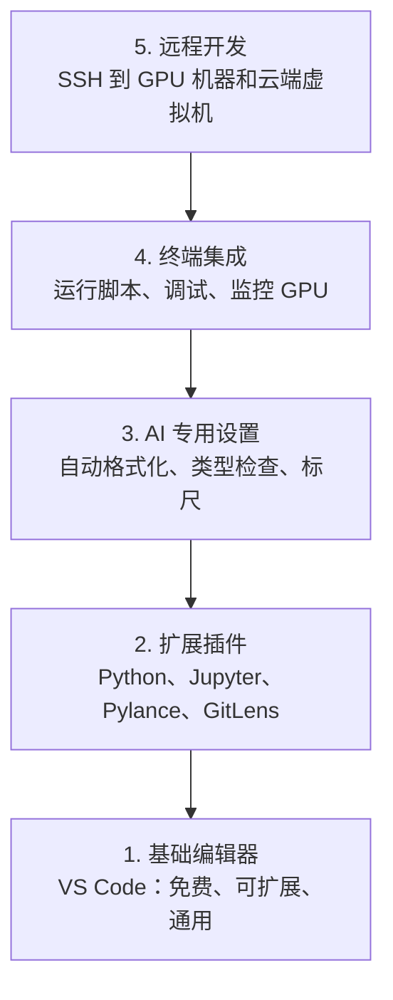

# 编辑器设置

> 你的编辑器就是你的副驾驶。一次配置好，让它别再添乱，开始真正帮你干活。

**Type:** Build
**Languages:** --
**Prerequisites:** Phase 0, Lesson 01
**Time:** ~20 minutes

## 学习目标

- 安装 VS Code，并补齐 Python、Jupyter、linting 和 Remote SSH 的核心扩展
- 为 AI 工作流配置保存时格式化、类型检查和 notebook 输出滚动
- 设置 Remote SSH，像操作本地一样在远程 GPU 机器上编辑和调试代码
- 了解其他编辑器选择（Cursor、Windsurf、Neovim）以及它们在 AI 工作中的权衡

## 问题

接下来你会在编辑器里花上成千上万小时：写 Python、运行 notebook、调试训练循环、SSH 到 GPU 机器。如果编辑器没有配好，每次打开项目都会有阻力：没有自动补全、没有类型提示、没有行内报错、格式化全靠手动、终端工作流也很笨重。

正确配置只要 20 分钟。跳过这一步，你每天都会多浪费 20 分钟。

## 核心概念

一个适合 AI 工程的编辑器配置需要五样东西：



## 动手搭建

### 第 1 步：安装 VS Code

推荐使用 VS Code。它免费、支持所有主流操作系统、对 Jupyter notebook 的支持非常成熟，而且扩展生态足够覆盖 AI 工作所需的一切。

下载地址：[code.visualstudio.com](https://code.visualstudio.com/)。

在终端里验证安装：

```bash
code --version
```

如果在 macOS 上提示找不到 `code`，打开 VS Code，按 `Cmd+Shift+P`，输入 “Shell Command”，然后选择 “Install 'code' command in PATH”。

### 第 2 步：安装核心扩展

打开 VS Code 的内置终端（`Ctrl+\`` 或 `Cmd+\``），安装这些对 AI 工作最重要的扩展：

```bash
code --install-extension ms-python.python
code --install-extension ms-python.vscode-pylance
code --install-extension ms-python.vscode-pylancecode --install-extension eamodio.gitlens
code --install-extension ms-vscode-remote.remote-ssh
code --install-extension ms-python.debugpy
code --install-extension ms-python.black-formatter
code --install-extension charliermarsh.ruff
```

每个扩展的作用：

| 扩展 | 为什么需要 |
|-----------|-----|
| Python | Python 语言支持、虚拟环境识别、运行与调试 |
| Pylance | 快速类型检查、自动补全、导入解析 |
| Jupyter | 在 VS Code 里运行 notebook，查看变量 |
| GitLens | 看是谁改了哪一行，直接显示 git blame |
| Remote SSH | 像本地一样打开远程 GPU 机器上的文件夹 |
| Debugpy | Python 单步调试 |
| Black Formatter | 保存时自动格式化，统一代码风格 |
| Ruff | 高速 lint，能尽早抓住常见错误 |

本课里的 `code/.vscode/extensions.json` 已经包含完整推荐列表。你打开项目文件夹时，VS Code 会提示你安装它们。

### 第 3 步：配置设置

把本课 `code/.vscode/settings.json` 里的设置复制过去，或者通过 `Settings > Open Settings (JSON)` 手动应用。

对 AI 工作最关键的设置：

```jsonc
{
    "python.analysis.typeCheckingMode": "basic",
    "editor.formatOnSave": true,
    "editor.rulers": [88, 120],
    "notebook.output.scrolling": true,
    "files.autoSave": "afterDelay"
}
```

为什么这些设置很重要：

- **类型检查设为 basic**：在运行前就能抓住参数类型错误。对张量 shape 不匹配、API 参数传错这种问题，能省下不少调试时间。
- **保存时格式化**：以后不用再考虑格式问题，Black 会自动处理。
- **88 和 120 的标尺**：Black 默认在 88 列换行，120 列标尺则用来提醒 docstring 和注释是不是太长了。
- **Notebook 输出滚动**：训练循环经常会打印上千行日志。不开滚动的话，输出面板会直接膨胀到不可读。
- **自动保存**：你一定会忘记保存。然后训练脚本跑的还是旧代码。自动保存就是为了解决这个问题。

### 第 4 步：终端集成

VS Code 的内置终端，是你运行训练脚本、监控 GPU、管理环境的主阵地。

建议这样配置：

```jsonc
{
    "terminal.integrated.defaultProfile.osx": "zsh",
    "terminal.integrated.defaultProfile.linux": "bash",
    "terminal.integrated.fontSize": 13,
    "terminal.integrated.scrollback": 10000
}
```

常用快捷键：

| 操作 | macOS | Linux/Windows |
|--------|-------|---------------|
| 打开/关闭终端 | `Ctrl+\`` | `Ctrl+\`` |
| 新建终端 | `Ctrl+Shift+\`` | `Ctrl+Shift+\`` |
| 拆分终端 | `Cmd+\\` | `Ctrl+\\` |

拆分终端非常实用：一个跑脚本，另一个用 `nvidia-smi -l 1` 或 `watch -n 1 nvidia-smi` 盯 GPU。

### 第 5 步：远程开发（SSH 到 GPU 机器）

这是 AI 工作里最重要的扩展之一。你会把训练任务跑在远程机器上（云主机、实验室服务器、Lambda、Vast.ai）。Remote SSH 可以让你直接打开远程文件系统、编辑文件、跑终端、调试程序，体验几乎和本地一致。

配置步骤：

1. 安装 Remote SSH 扩展（第 2 步已完成）。
2. 按 `Ctrl+Shift+P`（或 `Cmd+Shift+P`），输入 “Remote-SSH: Connect to Host”。
3. 输入 `user@your-gpu-box-ip`。
4. VS Code 会自动在远程机器上安装它的服务端组件。

为了免密码登录，配置 SSH key：

```bash
ssh-keygen -t ed25519 -C "your-email@example.com"
ssh-copy-id user@your-gpu-box-ip
```

把主机写进 `~/.ssh/config`，用起来会方便很多：

```text
Host gpu-box
    HostName 203.0.113.50
    User ubuntu
    IdentityFile ~/.ssh/id_ed25519
    ForwardAgent yes
```

之后通过 `Remote-SSH: Connect to Host > gpu-box` 就能秒连。

## 其他选择

### Cursor

[cursor.com](https://cursor.com) 是基于 VS Code 的一个分支，内置了 AI 代码生成功能。它沿用相同的扩展生态和设置格式。所以如果你用 Cursor，这一课的内容仍然成立，直接导入同样的 `settings.json` 和 `extensions.json` 就行。

### Windsurf

[windsurf.com](https://windsurf.com) 也是一个 AI 优先的 VS Code 分支。情况基本一样：扩展兼容、设置格式兼容，也支持 Remote SSH。

### Vim/Neovim

如果你已经在用 Vim 或 Neovim，而且效率很高，那就继续用。面向 AI Python 工作的最低配置包括：

- **pyright** 或 **pylsp**：负责类型检查（可通过 Mason 或手动安装）
- **nvim-lspconfig**：负责语言服务器集成
- **jupyter-vim** 或 **molten-nvim**：提供类似 notebook 的执行体验
- **telescope.nvim**：用于文件和符号搜索
- **none-ls.nvim** 配合 black 和 ruff：负责格式化与 lint

但如果你现在还不用 Vim，不要在这个阶段开始学。它的学习曲线会和你学习 AI 工程本身抢注意力。直接用 VS Code。

## 用起来

完成这些配置后，你的日常工作流大概会是这样：

1. 在 VS Code 中打开项目文件夹（或者通过 Remote SSH 连接到 GPU 机器）。
2. 在编辑器里写 Python，同时享受自动补全、类型提示和行内报错。
3. 用 Jupyter 扩展直接在编辑器里运行 notebook。
4. 用内置终端跑训练脚本、执行 `uv pip install`、监控 GPU。
5. 提交前用 GitLens 检查变更。

## 练习

1. 安装 VS Code，以及第 2 步列出的所有扩展
2. 把本课的 `settings.json` 复制到你的 VS Code 配置里
3. 打开一个 Python 文件，确认 Pylance 能显示类型提示，Black 能在保存时自动格式化
4. 如果你有远程机器可用，配置 Remote SSH 并打开它上的一个文件夹

## 关键术语

| 术语 | 大家常说 | 实际意思 |
|------|----------------|----------------------|
| LSP | “自动补全引擎” | Language Server Protocol，语言服务器协议。编辑器通过它从特定语言的服务端拿到类型信息、补全建议和诊断结果 |
| Pylance | “那个 Python 插件” | 微软的 Python 语言服务器，底层使用 Pyright 提供类型检查和 IntelliSense |
| Remote SSH | “在服务器上开发” | VS Code 扩展，会在远程机器上运行一个轻量服务端，再把界面能力流式回传到本地编辑器 |
| Format on save | “自动排版” | 每次保存时，编辑器都会自动运行格式化工具（如 Black、Ruff），从而保持统一代码风格 |
