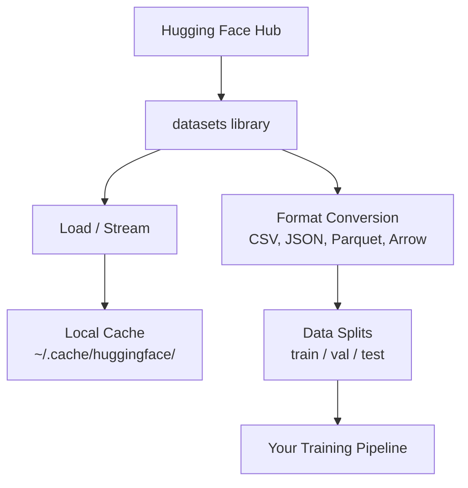

# 数据管理

> 数据是燃料。你怎么管理它，决定了你能跑多快。

**Type:** Build
**Language:** Python
**Prerequisites:** Phase 0, Lesson 01
**Time:** ~45 minutes

## 学习目标

- 使用 Hugging Face `datasets` 库加载、流式读取与缓存数据集
- 在 CSV、JSON、Parquet、Arrow 之间转换，并解释各自权衡
- 用固定随机种子创建可复现的 train/validation/test 划分
- 使用 `.gitignore`、Git LFS 或 DVC 管理大模型与大数据文件

## 问题

每个 AI 项目都从数据开始：找数据集、下载、格式转换、切分训练与评估、版本管理以保证实验可复现。每次手工做这些事既慢又容易出错。你需要一个可重复的工作流。

## 核心概念



Hugging Face 的 `datasets` 库是 AI 工作里加载数据的事实标准。它开箱即用地处理下载、缓存、格式转换与 streaming。

## 动手搭建

### 第 1 步：安装 datasets

```bash
pip install datasets huggingface_hub
```

### 第 2 步：加载数据集

```python
from datasets import load_dataset

dataset = load_dataset("imdb")
print(dataset)
print(dataset["train"][0])
```

这会下载 IMDB 影评数据集。第一次下载后，会从缓存 `~/.cache/huggingface/datasets/` 加载。

### 第 3 步：流式读取大数据集

有些数据集太大，无法放进磁盘。Streaming 会逐行加载，而不是先把全部下载完。

```python
dataset = load_dataset("wikimedia/wikipedia", "20220301.en", split="train", streaming=True)

for i, example in enumerate(dataset):
    print(example["title"])
    if i >= 4:
        break
```

Streaming 会返回一个 `IterableDataset`。你一边来一边处理，内存使用量与数据集大小无关。

### 第 4 步：数据格式

`datasets` 库底层使用 Apache Arrow。你可以根据流水线需要转换为其他格式。

```python
dataset = load_dataset("imdb", split="train")

dataset.to_csv("imdb_train.csv")
dataset.to_json("imdb_train.json")
dataset.to_parquet("imdb_train.parquet")
```

格式对比：

| Format | Size | Read Speed | Best For |
|--------|------|-----------|----------|
| CSV | Large | Slow | 可读性、表格工具 |
| JSON | Large | Slow | API、嵌套数据 |
| Parquet | Small | Fast | 分析与列式查询 |
| Arrow | Small | Fastest | 内存处理（`datasets` 内部格式） |

对 AI 来说，Parquet 通常是最佳落盘格式；Arrow 是内存里的工作格式；CSV/JSON 更多用于交换与兼容。

### 第 5 步：数据切分（splits）

每个 ML 项目通常需要三份切分：

- **Train**：模型用来学习（通常 80%）
- **Validation**：训练过程中评估与调参（通常 10%）
- **Test**：训练完成后的最终评估（通常 10%）

有些数据集自带切分；没有的话就自己切：

```python
dataset = load_dataset("imdb", split="train")

split = dataset.train_test_split(test_size=0.2, seed=42)
train_val = split["train"].train_test_split(test_size=0.125, seed=42)

train_ds = train_val["train"]
val_ds = train_val["test"]
test_ds = split["test"]

print(f"Train: {len(train_ds)}, Val: {len(val_ds)}, Test: {len(test_ds)}")
```

务必设置 seed 保证可复现。同一个 seed 每次都会得到同一份切分。

### 第 6 步：下载与缓存模型

模型通常是大文件。`huggingface_hub` 负责下载与缓存。

```python
from huggingface_hub import hf_hub_download, snapshot_download

model_path = hf_hub_download(
    repo_id="sentence-transformers/all-MiniLM-L6-v2",
    filename="config.json"
)
print(f"Cached at: {model_path}")

model_dir = snapshot_download("sentence-transformers/all-MiniLM-L6-v2")
print(f"Full model at: {model_dir}")
```

模型会缓存到 `~/.cache/huggingface/hub/`。下载一次后，下次加载会非常快。

### 第 7 步：处理大文件

模型权重与大数据集不应该进 git。三种常见方案：

**Option A: `.gitignore`（最简单）**

```text
*.bin
*.safetensors
*.pt
*.onnx
data/*.parquet
data/*.csv
models/
```

**Option B: Git LFS（用 git 跟踪大文件）**

```bash
git lfs install
git lfs track "*.bin"
git lfs track "*.safetensors"
git add .gitattributes
```

Git LFS 会在仓库里存指针，真正的大文件存到单独的服务器。GitHub 免费额度为 1GB。

**Option C: DVC（数据版本控制）**

```bash
pip install dvc
dvc init
dvc add data/training_set.parquet
git add data/training_set.parquet.dvc data/.gitignore
git commit -m "Track training data with DVC"
```

DVC 会生成小的 `.dvc` 文件指向数据本体；数据可以存到 S3、GCS 或其他远端存储。

| Approach | Complexity | Best For |
|----------|-----------|----------|
| .gitignore | Low | 个人项目、可重新下载的数据 |
| Git LFS | Medium | 团队通过 git 共享模型权重 |
| DVC | High | 跨机器可复现实验、大规模数据、团队协作 |

对本课程来说，`.gitignore` 足够了。需要跨机器复现严格实验时再考虑 DVC。

### 第 8 步：存储模式

**本地存储** 适合 ~10GB 以内的数据集，HF cache 会自动处理。

**云存储** 适合更大体量或需要跨机器共享的数据：

```python
import os

local_path = os.path.expanduser("~/.cache/huggingface/datasets/")

# s3_path = "s3://my-bucket/datasets/"
# gcs_path = "gs://my-bucket/datasets/"
```

DVC 可以直接对接 S3/GCS：

```bash
dvc remote add -d myremote s3://my-bucket/dvc-store
dvc push
```

对本课程而言，本地存储足够；当你在远程 GPU 实例上做微调时，云端存储会更重要。

## 本课程会用到的数据集

| Dataset | Lessons | Size | What It Teaches |
|---------|---------|------|----------------|
| IMDB | Tokenization, classification | 84 MB | 文本分类基础 |
| WikiText | Language modeling | 181 MB | next-token prediction |
| SQuAD | QA systems | 35 MB | 问答与 span |
| Common Crawl (subset) | Embeddings | Varies | 大规模文本处理 |
| MNIST | Vision basics | 21 MB | 图像分类入门 |
| COCO (subset) | Multimodal | Varies | 图文配对 |

你不需要现在就下载所有数据集。每节课会明确它需要什么。

## 用起来

运行工具脚本验证整套流程：

```bash
python code/data_utils.py
```

它会下载一个小数据集、做格式转换、切分，并打印摘要信息。

## 交付物

本课产出：
- `code/data_utils.py`：可复用的数据加载与缓存工具
- `outputs/prompt-data-helper.md`：用于找到合适数据集的 prompt

## 练习

1. 用 `mrpc` 配置加载 `glue` 数据集，并查看前 5 条样本
2. Streaming 方式读取 `c4` 数据集，统计你在 10 秒内能处理多少条样本
3. 把一个数据集转成 Parquet，对比它与 CSV 的文件大小
4. 创建 70/15/15 的 train/val/test 切分（固定 seed），并验证切分规模

## 关键术语

| Term | What people say | What it actually means |
|------|----------------|----------------------|
| Dataset split | "Training data" | 生命周期不同阶段使用的子集（train/val/test） |
| Streaming | "Load it lazily" | 不下载全量数据，按行从远端读取处理 |
| Parquet | "Compressed CSV" | 列式文件格式，适合分析查询与高效存储 |
| Arrow | "Fast dataframe" | 内存列式格式；datasets 内部用于零拷贝读写 |
| Git LFS | "Git for big files" | 将大文件存到 git 之外，同时在仓库里保留指针 |
| DVC | "Git for data" | 面向数据集与模型的版本控制系统，可集成云存储 |
| Cache | "Already downloaded" | 已下载数据的本地副本，默认在 `~/.cache/huggingface/` |

