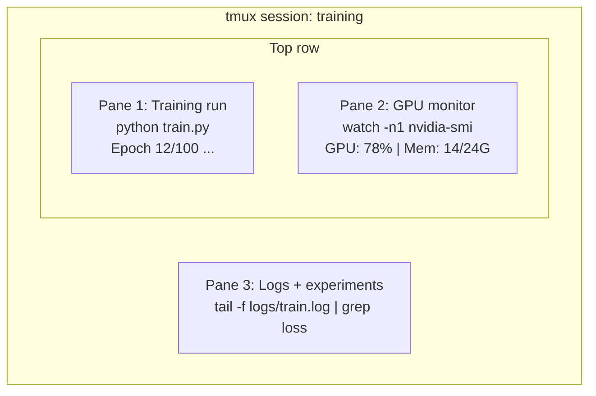

# 终端与 Shell

> 终端是 AI 工程师的主场。把这里练熟。

**Type:** Learn
**Languages:** --
**Prerequisites:** Phase 0, Lesson 01
**Time:** ~35 minutes

## 学习目标

- 使用管道、重定向与 `grep` 在命令行中过滤并处理训练日志
- 使用 tmux 建立可持久化的会话与多面板，用于并行训练与 GPU 监控
- 使用 `htop`、`nvtop`、`nvidia-smi` 监控系统与 GPU 资源
- 使用 SSH、`scp`、`rsync` 在本地与远程机器之间传输文件

## 问题

你在终端里花的时间会超过任何编辑器：训练、监控 GPU、tail 日志、远程 SSH、管理环境。几乎每个 AI 工作流都会碰到 shell。如果你在这里慢，你在所有地方都慢。

本课只讲 AI 工作中真正用得上的终端技能：不讲 Unix 历史，不深挖 Bash 脚本，只讲你需要的。

## 核心概念



三个任务同时跑，一个终端窗口就够。你可以 detach 回家，之后再 SSH 回来 reattach，训练照样在跑。

## 动手搭建

### 第 1 步：认识你的 shell

查看你当前使用的 shell：

```bash
echo $SHELL
```

多数系统用 `bash` 或 `zsh`。两者都可以。本课程的命令在它们上都能工作。

你需要知道的基础操作：

```bash
# Move around
cd ~/projects/ai-engineering-from-scratch
pwd
ls -la

# History search (most useful shortcut you'll learn)
# Ctrl+R then type part of a previous command
# Press Ctrl+R again to cycle through matches

# Clear terminal
clear   # or Ctrl+L

# Cancel a running command
# Ctrl+C

# Suspend a running command (resume with fg)
# Ctrl+Z
```

### 第 2 步：管道与重定向

管道把多个命令串起来，这是处理日志、过滤输出、链式组合工具的核心技能，你会一直用它。

```bash
# Count how many times "loss" appears in a log
cat train.log | grep "loss" | wc -l

# Extract just the loss values from training output
grep "loss:" train.log | awk '{print $NF}' > losses.txt

# Watch a log file update in real time, filtering for errors
tail -f train.log | grep --line-buffered "ERROR"

# Sort experiments by final accuracy
grep "final_accuracy" results/*.log | sort -t= -k2 -n -r

# Redirect stdout and stderr to separate files
python train.py > output.log 2> errors.log

# Redirect both to the same file
python train.py > train_full.log 2>&1
```

你只需要记住这几个符号：

| Symbol | What it does |
|--------|-------------|
| `>` | 把 stdout 写入文件（覆盖） |
| `>>` | 把 stdout 追加到文件 |
| `2>` | 把 stderr 写入文件 |
| `2>&1` | 把 stderr 发送到 stdout 的同一去处 |
| `\|` | 把前一个命令的 stdout 作为后一个命令的 stdin |

### 第 3 步：后台进程

训练经常要跑几个小时。你不想一直开着终端窗口。

```bash
# Run in background (output still goes to terminal)
python train.py &

# Run in background, immune to hangup (closing terminal won't kill it)
nohup python train.py > train.log 2>&1 &

# Check what's running in background
jobs
ps aux | grep train.py

# Bring a background job to foreground
fg %1

# Kill a background process
kill %1
# or find its PID and kill that
kill $(pgrep -f "train.py")
```

`&`、`nohup`、`screen`/`tmux` 的差别：

| Method | Survives terminal close? | Can reattach? |
|--------|-------------------------|---------------|
| `command &` | No | No |
| `nohup command &` | Yes | No（看 log 文件） |
| `screen` / `tmux` | Yes | Yes |

跑超过几分钟的任务，直接用 tmux。

### 第 4 步：tmux

tmux 让你创建持久会话，并在一个窗口里拆分多个 pane。这是管理训练任务最有用的工具之一。

```bash
# Install
# macOS
brew install tmux
# Ubuntu
sudo apt install tmux

# Start a named session
tmux new -s training

# Split horizontally
# Ctrl+B then "

# Split vertically
# Ctrl+B then %

# Navigate between panes
# Ctrl+B then arrow keys

# Detach (session keeps running)
# Ctrl+B then d

# Reattach
tmux attach -t training

# List sessions
tmux ls

# Kill a session
tmux kill-session -t training
```

一个典型的 AI 训练会话：

```bash
tmux new -s train

# Pane 1: start training
python train.py --epochs 100 --lr 1e-4

# Ctrl+B, " to split, then run GPU monitor
watch -n1 nvidia-smi

# Ctrl+B, % to split vertically, tail the logs
tail -f logs/experiment.log

# Now detach with Ctrl+B, d
# SSH out, go get coffee, come back
# tmux attach -t train
```

### 第 5 步：用 htop 和 nvtop 监控

```bash
# System processes (better than top)
htop

# GPU processes (if you have NVIDIA GPU)
# Install: sudo apt install nvtop (Ubuntu) or brew install nvtop (macOS)
nvtop

# Quick GPU check without nvtop
nvidia-smi

# Watch GPU usage update every second
watch -n1 nvidia-smi

# See which processes are using the GPU
nvidia-smi --query-compute-apps=pid,name,used_memory --format=csv
```

`htop` 常用快捷键：
- `F6` 或 `>`：按列排序（按内存排序找泄漏）
- `F5`：树形视图（看子进程）
- `F9`：kill 进程
- `/`：按进程名搜索

### 第 6 步：SSH 连接远程 GPU

租云 GPU（Lambda、RunPod、Vast.ai）一般都靠 SSH 连接。

```bash
# Basic connection
ssh user@gpu-box-ip

# With a specific key
ssh -i ~/.ssh/my_gpu_key user@gpu-box-ip

# Copy files to remote
scp model.pt user@gpu-box-ip:~/models/

# Copy files from remote
scp user@gpu-box-ip:~/results/metrics.json ./

# Sync a whole directory (faster for many files)
rsync -avz ./data/ user@gpu-box-ip:~/data/

# Port forward (access remote Jupyter/TensorBoard locally)
ssh -L 8888:localhost:8888 user@gpu-box-ip
# Now open localhost:8888 in your browser

# SSH config for convenience
# Add to ~/.ssh/config:
# Host gpu
#     HostName 192.168.1.100
#     User ubuntu
#     IdentityFile ~/.ssh/gpu_key
#
# Then just:
# ssh gpu
```

### 第 7 步：AI 工作常用 alias

把这些加到 `~/.bashrc` 或 `~/.zshrc`：

```bash
source phases/00-setup-and-tooling/10-terminal-and-shell/code/shell_aliases.sh
```

或者拷贝你需要的。关键 alias：

```bash
# GPU status at a glance
alias gpu='nvidia-smi --query-gpu=index,name,utilization.gpu,memory.used,memory.total,temperature.gpu --format=csv,noheader'

# Kill all Python training processes
alias killtraining='pkill -f "python.*train"'

# Quick virtual environment activate
alias ae='source .venv/bin/activate'

# Watch training loss
alias watchloss='tail -f logs/*.log | grep --line-buffered "loss"'
```

完整列表见 `code/shell_aliases.sh`。

### 第 8 步：AI 常见终端模式

这些在真实工作中会反复出现：

```bash
# Run training, log everything, notify when done
python train.py 2>&1 | tee train.log; echo "DONE" | mail -s "Training complete" you@email.com

# Compare two experiment logs side by side
diff <(grep "accuracy" exp1.log) <(grep "accuracy" exp2.log)

# Find the largest model files (clean up disk space)
find . -name "*.pt" -o -name "*.safetensors" | xargs du -h | sort -rh | head -20

# Download a model from Hugging Face
wget https://huggingface.co/model/resolve/main/model.safetensors

# Untar a dataset
tar xzf dataset.tar.gz -C ./data/

# Count lines in all Python files (see how big your project is)
find . -name "*.py" | xargs wc -l | tail -1

# Check disk space (training data fills disks fast)
df -h
du -sh ./data/*

# Environment variable check before training
env | grep -i cuda
env | grep -i torch
```

## 用起来

本课程中每个工具的使用时机：

| Tool | When you use it |
|------|----------------|
| tmux | 每次训练（Phases 3+） |
| `tail -f` + `grep` | 监控训练日志 |
| `nohup` / `&` | 快速后台任务 |
| `htop` / `nvtop` | 排查训练慢、OOM |
| SSH + `rsync` | 云端 GPU 工作流 |
| 管道与重定向 | 处理实验结果 |
| Aliases | 省掉重复敲命令的时间 |

## 练习

1. 安装 tmux，创建一个含 3 个 pane 的会话：一个跑 `htop`，一个跑 `watch -n1 date`，一个跑 Python 脚本；detach 再 reattach
2. 把 `code/shell_aliases.sh` 里的 alias 加进你的 shell 配置，并用 `source ~/.zshrc`（或 `~/.bashrc`）重新加载
3. 用 `for i in $(seq 1 100); do echo "epoch $i loss: $(echo "scale=4; 1/$i" | bc)"; sleep 0.1; done > fake_train.log` 生成假的训练日志，然后用 `grep`、`tail`、`awk` 提取 loss 数值
4. 给你能访问的一台服务器配置 SSH config（或用 `localhost` 练习语法）

## 关键术语

| Term | What people say | What it actually means |
|------|----------------|----------------------|
| Shell | "The terminal" | 解释命令的程序（bash、zsh、fish） |
| tmux | "Terminal multiplexer" | 一个程序：在单窗口里管理多会话，并支持 detach/reattach |
| Pipe | "The bar thing" | `\|` 运算符：把一个命令输出作为另一个命令输入 |
| PID | "Process ID" | 每个进程的唯一编号，用于监控与终止 |
| nohup | "No hangup" | 让命令不受挂断信号影响，关闭终端也不终止 |
| SSH | "Connecting to the server" | 安全外壳协议：加密地在远程机器上执行命令 |

