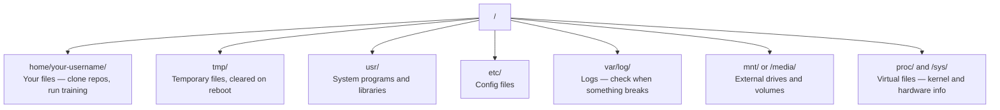

# 面向 AI 的 Linux

> 大多数 AI 都跑在 Linux 上。你只需要掌握“不被卡住”的那部分。

**Type:** Learn
**Languages:** --
**Prerequisites:** Phase 0, Lesson 01
**Time:** ~30 minutes

## 学习目标

- 在命令行中浏览 Linux 文件系统并完成常用文件操作
- 使用 `chmod` 与 `chown` 管理权限，解决 “Permission denied”
- 用 `apt` 安装系统包，把一台新 GPU 机器快速配置成可用的 AI 环境
- 识别 macOS 到 Linux 的常见差异，避免远程开发时踩坑

## 问题

你可能在 macOS 或 Windows 上开发。但只要你 SSH 进云端 GPU 机器、租 Lambda 实例或开一台 EC2，你落地的几乎都是 Ubuntu。终端就是你唯一的界面：没有 Finder、没有 Explorer、没有 GUI。你如果不会在命令行里浏览文件、安装包、管理进程，就会一边付着空转的 GPU 费用，一边搜索 “how to unzip a file in Linux”。

这是一份生存手册：只覆盖你在远程 Linux 上做 AI 工作真正会用到的内容，不多讲。

## 文件系统布局

Linux 把一切都组织在一个根目录 `/` 下面，没有 `C:\\` 也没有 `/Volumes`。你真正会碰到的目录：



你的 home 目录是 `~`（即 `/home/your-username`）。你 90% 的操作都发生在这里。

## 必会命令

这 15 个命令覆盖你在远程 GPU 机器上 95% 的操作。

### 目录移动

```bash
pwd                         # Where am I?
ls                          # What's here?
ls -la                      # What's here, including hidden files with details?
cd /path/to/dir             # Go there
cd ~                        # Go home
cd ..                       # Go up one level
```

### 文件与目录

```bash
mkdir my-project            # Create a directory
mkdir -p a/b/c              # Create nested directories in one shot

cp file.txt backup.txt      # Copy a file
cp -r src/ src-backup/      # Copy a directory (recursive)

mv old.txt new.txt          # Rename a file
mv file.txt /tmp/           # Move a file

rm file.txt                 # Delete a file (no trash, it's gone)
rm -rf my-dir/              # Delete a directory and everything inside
```

`rm -rf` 是不可逆的，没有回收站。按回车前先确认路径。

### 阅读文件

```bash
cat file.txt                # Print entire file
head -20 file.txt           # First 20 lines
tail -20 file.txt           # Last 20 lines
tail -f log.txt             # Follow a log file in real time (Ctrl+C to stop)
less file.txt               # Scroll through a file (q to quit)
```

### 搜索

```bash
grep "error" training.log           # Find lines containing "error"
grep -r "learning_rate" .           # Search all files in current directory
grep -i "cuda" config.yaml          # Case-insensitive search

find . -name "*.py"                 # Find all Python files under current dir
find . -name "*.ckpt" -size +1G     # Find checkpoint files larger than 1GB
```

## 权限（Permissions）

Linux 的每个文件都有 owner 与权限位。脚本跑不起来、目录写不进去，多半是权限问题。

```bash
ls -l train.py
# -rwxr-xr-- 1 user group 2048 Mar 19 10:00 train.py
#  ^^^             owner permissions: read, write, execute
#     ^^^          group permissions: read, execute
#        ^^        everyone else: read only
```

常见修复：

```bash
chmod +x train.sh           # Make a script executable
chmod 755 deploy.sh         # Owner: full, others: read+execute
chmod 644 config.yaml       # Owner: read+write, others: read only

chown user:group file.txt   # Change who owns a file (needs sudo)
```

出现 “Permission denied”，基本就是权限问题：`chmod +x` 或加 `sudo` 往往就能解决。

## 包管理（apt）

Ubuntu 使用 `apt` 安装系统级软件：

```bash
sudo apt update             # Refresh the package list (always do this first)
sudo apt install -y htop    # Install a package (-y skips confirmation)
sudo apt install -y build-essential  # C compiler, make, etc. Needed by many Python packages
sudo apt install -y tmux    # Terminal multiplexer (keep sessions alive after disconnect)

apt list --installed        # What's installed?
sudo apt remove htop        # Uninstall
```

一台新 GPU 机器上常装的包：

```bash
sudo apt update && sudo apt install -y \
    build-essential \
    git \
    curl \
    wget \
    tmux \
    htop \
    unzip \
    python3-venv
```

## 用户与 sudo

你通常以普通用户登录，部分操作需要 root 权限：

```bash
whoami                      # What user am I?
sudo command                # Run a single command as root
sudo su                     # Become root (exit to go back, use sparingly)
```

云端 GPU 实例通常只有你一个用户，也往往有 sudo 权限。不要把一切都用 root 跑，只在需要时用 sudo。

## 进程与 systemd

训练卡住了，或者你想确认在跑什么：

```bash
htop                        # Interactive process viewer (q to quit)
ps aux | grep python        # Find running Python processes
kill 12345                  # Gracefully stop process with PID 12345
kill -9 12345               # Force kill (use when graceful doesn't work)
nvidia-smi                  # GPU processes and memory usage
```

systemd 用于管理服务（后台守护进程）。当你跑推理服务时会用到：

```bash
sudo systemctl start nginx          # Start a service
sudo systemctl stop nginx           # Stop it
sudo systemctl restart nginx        # Restart it
sudo systemctl status nginx         # Check if it's running
sudo systemctl enable nginx         # Start automatically on boot
```

## 磁盘空间

GPU 机器的磁盘通常不大，模型和数据集很快就会把它填满。

```bash
df -h                       # Disk usage for all mounted drives
df -h /home                 # Disk usage for /home specifically

du -sh *                    # Size of each item in current directory
du -sh ~/.cache             # Size of your cache (pip, huggingface models land here)
du -sh /data/checkpoints/   # Check how big your checkpoints are

# Find the biggest space hogs
du -h --max-depth=1 / 2>/dev/null | sort -hr | head -20
```

常见节省空间的方法：

```bash
# Clear pip cache
pip cache purge

# Clear apt cache
sudo apt clean

# Remove old checkpoints you don't need
rm -rf checkpoints/epoch_01/ checkpoints/epoch_02/
```

## 网络相关

你会在命令行中下载模型、传文件、访问 API：

```bash
# Download files
wget https://example.com/model.bin                   # Download a file
curl -O https://example.com/data.tar.gz              # Same thing with curl
curl -s https://api.example.com/health | python3 -m json.tool  # Hit an API, pretty-print JSON

# Transfer files between machines
scp model.bin user@remote:/data/                     # Copy file to remote machine
scp user@remote:/data/results.csv .                  # Copy file from remote to local
scp -r user@remote:/data/checkpoints/ ./local-dir/   # Copy directory

# Sync directories (faster than scp for large transfers, resumes on failure)
rsync -avz --progress ./data/ user@remote:/data/
rsync -avz --progress user@remote:/results/ ./results/
```

大文件尽量用 `rsync` 而不是 `scp`：它只传变化的字节，并能断点续传。

## tmux：保持会话不断线

SSH 进远程机器后，你合上电脑可能就把训练干掉了。tmux 可以避免这一点。

```bash
tmux new -s train           # Start a new session named "train"
# ... start your training, then:
# Ctrl+B, then D            # Detach (training keeps running)

tmux ls                     # List sessions
tmux attach -t train        # Reattach to session

# Inside tmux:
# Ctrl+B, then %            # Split pane vertically
# Ctrl+B, then "            # Split pane horizontally
# Ctrl+B, then arrow keys   # Switch between panes
```

长时间训练永远放在 tmux 里跑。永远。

## Windows 用户：WSL2

如果你在 Windows 上，WSL2 能让你获得一个真正的 Linux 环境，不需要双系统。

```bash
# In PowerShell (admin)
wsl --install -d Ubuntu-24.04

# After restart, open Ubuntu from Start menu
sudo apt update && sudo apt upgrade -y
```

WSL2 运行真实的 Linux kernel。本课的所有内容在 WSL2 里都适用。你的 Windows 文件在 WSL2 内部路径是 `/mnt/c/Users/YourName/`。

GPU 直通依赖 Windows 侧安装的 NVIDIA 驱动（不是 Linux 的）。安装 Windows NVIDIA driver 后，WSL2 内部也能看到 CUDA。

## macOS 到 Linux 的常见坑

如果你从 macOS 过来，这些地方会卡你：

| macOS | Linux | Notes |
|-------|-------|-------|
| `brew install` | `sudo apt install` | 包名有时不同：`brew install readline` vs `sudo apt install libreadline-dev` |
| `open file.txt` | `xdg-open file.txt` | 但远程机器通常没 GUI，更多用 `cat` / `less` |
| `pbcopy` / `pbpaste` | Not available | SSH 下没有剪贴板管道 |
| `~/.zshrc` | `~/.bashrc` | macOS 默认 zsh，很多 Linux 服务器默认 bash |
| `/opt/homebrew/` | `/usr/bin/`, `/usr/local/bin/` | 可执行文件路径不同 |
| `sed -i '' 's/a/b/' file` | `sed -i 's/a/b/' file` | macOS 的 `sed -i` 需要空字符串参数，Linux 不需要 |
| Case-insensitive filesystem | Case-sensitive filesystem | Linux 上 `Model.py` 与 `model.py` 是两个文件 |
| Line endings `\n` | Line endings `\n` | Linux/macOS 都是 `\n`；Windows 的 `\r\n` 会搞坏 bash 脚本，必要时用 `dos2unix` |

## 速查卡

```text
Navigation:     pwd, ls, cd, find
Files:          cp, mv, rm, mkdir, cat, head, tail, less
Search:         grep, find
Permissions:    chmod, chown, sudo
Packages:       apt update, apt install
Processes:      htop, ps, kill, nvidia-smi
Services:       systemctl start/stop/restart/status
Disk:           df -h, du -sh
Network:        curl, wget, scp, rsync
Sessions:       tmux new/attach/detach
```

## 练习

1. SSH 到任意 Linux 机器（或打开 WSL2），进入 home 目录，创建一个项目文件夹，在其中用 `touch` 创建 3 个空文件，然后用 `ls -la` 列出来
2. 用 apt 安装 `htop`，运行它并找出占用最多内存的进程
3. 新建一个 tmux 会话，在里面运行 `sleep 300`，detach，列出 session，再 reattach
4. 用 `df -h` 查看剩余磁盘空间，再用 `du -sh ~/.cache/*` 找出 cache 中占空间的目录
5. 用 `scp` 把一个文件从本地传到远端，再用 `rsync` 做同样的事，对比体验

