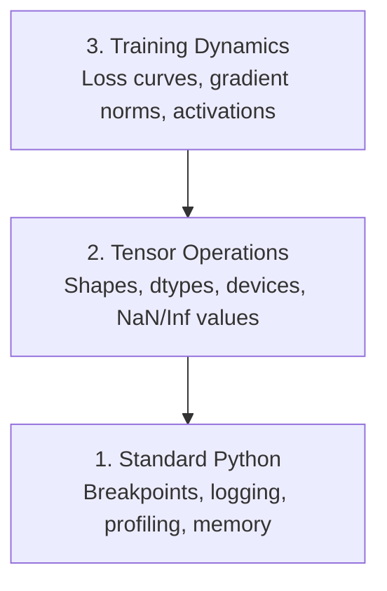

# 调试与性能分析

> 最糟糕的 AI bug 并不会崩溃。它会在垃圾数据上悄悄训练，然后给你一条“很漂亮”的 loss 曲线。

**Type:** Build
**Language:** Python
**Prerequisites:** Lesson 1 (Dev Environment), basic PyTorch familiarity
**Time:** ~60 minutes

## 学习目标

- 使用条件式 `breakpoint()` 与 `debug_print` 在训练中途检查张量的 shape、dtype 与 NaN
- 用 `cProfile`、`line_profiler`、`tracemalloc` 对训练循环做 profiling，定位瓶颈
- 识别常见 AI bug：shape 不匹配、NaN loss、数据泄漏、张量在错误设备上
- 配置 TensorBoard，观察 loss 曲线、权重直方图与梯度分布

## 问题

AI 代码失败的方式和普通代码不一样。Web 应用坏了会直接给你栈追踪；而训练循环配置错了，可能会跑 8 小时、烧掉 $200 的 GPU 时间，最后产出一个只会预测均值的模型。代码没有报错，bug 可能只是一个张量在错误设备上、忘了 `.detach()`、或者 label 泄漏进了 feature。

你需要能在浪费时间与算力之前，把这些“静默失败”抓出来的调试工具。

## 核心概念

AI 调试大致分三层：



很多人直接跳到第 3 层（盯着 TensorBoard）。但 80% 的 AI bug 都发生在第 1、2 层。

## 动手搭建

### Part 1：打印调试（是的，它有效）

打印调试经常被嫌弃，但不该。在张量代码里，一个有针对性的 print 往往比单步调试更有效，因为你需要一次看到 shape、dtype、数值范围等信息。

```python
def debug_print(name, tensor):
    print(f"{name}: shape={tensor.shape}, dtype={tensor.dtype}, "
          f"device={tensor.device}, "
          f"min={tensor.min().item():.4f}, max={tensor.max().item():.4f}, "
          f"mean={tensor.mean().item():.4f}, "
          f"has_nan={tensor.isnan().any().item()}")
```

在每个可疑操作之后调用它。找到 bug 后就删掉这些打印。简单有效。

### Part 2：Python 调试器（pdb 与 breakpoint）

内置调试器在 AI 工作里常被低估。把 `breakpoint()` 放进训练循环里，你就能交互式检查张量。

```python
def training_step(model, batch, criterion, optimizer):
    inputs, labels = batch
    outputs = model(inputs)
    loss = criterion(outputs, labels)

    if loss.item() > 100 or torch.isnan(loss):
        breakpoint()

    loss.backward()
    optimizer.step()
```

进入调试器后常用命令：

- `p outputs.shape` 查看 shape
- `p loss.item()` 查看 loss 数值
- `p torch.isnan(outputs).sum()` 统计 NaN 数量
- `p model.fc1.weight.grad` 查看梯度
- `c` 继续，`q` 退出

这是条件式调试：只有在异常发生时才停住。对 10,000 step 的训练来说很关键。

### Part 3：Python logging

当调试不止是快速检查时，用 logging 替代 print：

```python
import logging

logging.basicConfig(
    level=logging.INFO,
    format="%(asctime)s [%(levelname)s] %(message)s",
    handlers=[
        logging.FileHandler("training.log"),
        logging.StreamHandler()
    ]
)
logger = logging.getLogger(__name__)

logger.info("Starting training: lr=%.4f, batch_size=%d", lr, batch_size)
logger.warning("Loss spike detected: %.4f at step %d", loss.item(), step)
logger.error("NaN loss at step %d, stopping", step)
```

logging 提供时间戳、等级与文件输出。凌晨 3 点训练失败时，你想要的是一个日志文件，而不是已经滚出屏幕的终端输出。

### Part 4：给代码片段计时

想优化，先要知道时间花在哪。

```python
import time

class Timer:
    def __init__(self, name=""):
        self.name = name

    def __enter__(self):
        self.start = time.perf_counter()
        return self

    def __exit__(self, *args):
        elapsed = time.perf_counter() - self.start
        print(f"[{self.name}] {elapsed:.4f}s")

with Timer("data loading"):
    batch = next(dataloader_iter)

with Timer("forward pass"):
    outputs = model(batch)

with Timer("backward pass"):
    loss.backward()
```

常见结论：数据加载占了训练时间的 60%。这时应该先调 DataLoader 的 `num_workers > 0`，而不是换更快的 GPU。

### Part 5：cProfile 与 line_profiler

当手工计时不够用：

```bash
python -m cProfile -s cumtime train.py
```

这会按累计耗时列出所有函数调用。做逐行 profiling：

```bash
pip install line_profiler
```

```python
@profile
def train_step(model, data, target):
    output = model(data)
    loss = F.cross_entropy(output, target)
    loss.backward()
    return loss

# Run with: kernprof -l -v train.py
```

### Part 6：内存 profiling

#### CPU 内存：tracemalloc

```python
import tracemalloc

tracemalloc.start()

# your code here
model = build_model()
data = load_dataset()

snapshot = tracemalloc.take_snapshot()
top_stats = snapshot.statistics("lineno")
for stat in top_stats[:10]:
    print(stat)
```

#### CPU 内存：memory_profiler

```bash
pip install memory_profiler
```

```python
from memory_profiler import profile

@profile
def load_data():
    raw = read_csv("data.csv")       # watch memory jump here
    processed = preprocess(raw)       # and here
    return processed
```

用 `python -m memory_profiler your_script.py` 查看逐行内存使用。

#### GPU 内存：PyTorch

```python
import torch

if torch.cuda.is_available():
    print(torch.cuda.memory_summary())

    print(f"Allocated: {torch.cuda.memory_allocated() / 1e9:.2f} GB")
    print(f"Cached: {torch.cuda.memory_reserved() / 1e9:.2f} GB")
```

遇到 OOM（Out of Memory）时的顺序建议：

1. 降 batch size（永远先试这个）
2. 用 `torch.cuda.empty_cache()` 释放缓存
3. 对大中间张量用 `del tensor`，然后 `torch.cuda.empty_cache()`
4. 使用混合精度（`torch.cuda.amp`）把显存占用砍半
5. 对很深的模型使用 gradient checkpointing

### Part 7：常见 AI bug 以及怎么抓

#### Shape mismatch

最常见的 bug：张量 shape 是 `[batch, features]`，但模型期望的是 `[batch, channels, height, width]`。

```python
def check_shapes(model, sample_input):
    print(f"Input: {sample_input.shape}")
    hooks = []

    def make_hook(name):
        def hook(module, inp, out):
            in_shape = inp[0].shape if isinstance(inp, tuple) else inp.shape
            out_shape = out.shape if hasattr(out, "shape") else type(out)
            print(f"  {name}: {in_shape} -> {out_shape}")
        return hook

    for name, module in model.named_modules():
        hooks.append(module.register_forward_hook(make_hook(name)))

    with torch.no_grad():
        model(sample_input)

    for h in hooks:
        h.remove()
```

用一个 sample batch 跑一次，它会把模型中每一步的 shape 变换都打印出来。

#### NaN loss

NaN loss 表示某处炸了。常见原因：

- 学习率太高
- 自定义 loss 里除以 0
- 对 0 或负数取 log
- RNN 中梯度爆炸

```python
def detect_nan(model, loss, step):
    if torch.isnan(loss):
        print(f"NaN loss at step {step}")
        for name, param in model.named_parameters():
            if param.grad is not None:
                if torch.isnan(param.grad).any():
                    print(f"  NaN gradient in {name}")
                if torch.isinf(param.grad).any():
                    print(f"  Inf gradient in {name}")
        return True
    return False
```

#### 数据泄漏（Data leakage）

你的模型在 test 集上有 99% accuracy，听起来很棒，但往往是 bug。

```python
def check_data_leakage(train_set, test_set, id_column="id"):
    train_ids = set(train_set[id_column].tolist())
    test_ids = set(test_set[id_column].tolist())
    overlap = train_ids & test_ids
    if overlap:
        print(f"DATA LEAKAGE: {len(overlap)} samples in both train and test")
        return True
    return False
```

也要检查时间泄漏：用未来数据预测过去。切分前先按 timestamp 排序。

#### 设备错误（Wrong device）

张量分布在不同设备（CPU vs GPU）会导致运行时报错；但更隐蔽的是：某个张量悄悄留在 CPU，训练还能跑但会变慢很多。

```python
def check_devices(model, *tensors):
    model_device = next(model.parameters()).device
    print(f"Model device: {model_device}")
    for i, t in enumerate(tensors):
        if t.device != model_device:
            print(f"  WARNING: tensor {i} on {t.device}, model on {model_device}")
```

### Part 8：TensorBoard 基础

TensorBoard 能让你随时间观察训练状态。

```bash
pip install tensorboard
```

```python
from torch.utils.tensorboard import SummaryWriter

writer = SummaryWriter("runs/experiment_1")

for step in range(num_steps):
    loss = train_step(model, batch)

    writer.add_scalar("loss/train", loss.item(), step)
    writer.add_scalar("lr", optimizer.param_groups[0]["lr"], step)

    if step % 100 == 0:
        for name, param in model.named_parameters():
            writer.add_histogram(f"weights/{name}", param, step)
            if param.grad is not None:
                writer.add_histogram(f"grads/{name}", param.grad, step)

writer.close()
```

启动：

```bash
tensorboard --logdir=runs
```

观察点：

- **Loss 不下降**：学习率太低，或结构问题
- **Loss 大幅震荡**：学习率太高
- **Loss 变 NaN**：数值不稳定（见 NaN 部分）
- **Train loss 下降但 val loss 上升**：过拟合
- **权重直方图坍缩到 0**：梯度消失
- **梯度直方图爆炸**：需要梯度裁剪

### Part 9：VS Code Debugger

要交互式调试，在 VS Code 中配置 `launch.json`：

```json
{
    "version": "0.2.0",
    "configurations": [
        {
            "name": "Debug Training",
            "type": "debugpy",
            "request": "launch",
            "program": "${file}",
            "console": "integratedTerminal",
            "justMyCode": false
        }
    ]
}
```

点击行号左侧设置断点，用 Variables 面板查看张量属性。Debug Console 可以在执行中间运行任意 Python 表达式。

它尤其适合单步排查数据预处理流水线，因为你想看到每一步的转换结果。

## 用起来

下面这套工作流能抓住大多数 AI bug：

1. **训练前**：用 sample batch 运行 `check_shapes`，确认输入输出维度符合预期
2. **前 10 step**：用 `debug_print` 检查 loss、outputs、gradients，确认没有 NaN 且数值范围正常
3. **训练中**：记录 loss、学习率、梯度范数，并用 TensorBoard 可视化
4. **出问题时**：在失败点放 `breakpoint()`，交互式检查张量
5. **要提速时**：分别计时数据加载 / forward / backward；OOM 边缘时做内存 profiling

## 交付物

运行调试工具脚本：

```bash
python phases/00-setup-and-tooling/12-debugging-and-profiling/code/debug_tools.py
```

查看 `outputs/prompt-debug-ai-code.md`，里面有一个用于诊断 AI 特有 bug 的 prompt。

## 练习

1. 运行 `debug_tools.py` 并阅读每一节输出；修改 dummy model 引入 NaN（提示：在 forward 里除以 0），观察检测器如何捕获
2. 用 `cProfile` 对训练循环做 profiling，找出最慢的函数
3. 用 `tracemalloc` 找出数据加载流水线里哪一行分配了最多内存
4. 给一个简单训练接入 TensorBoard，并判断模型是否过拟合
5. 在训练循环中使用 `breakpoint()`，练习从调试器里检查 shape、device 与梯度

